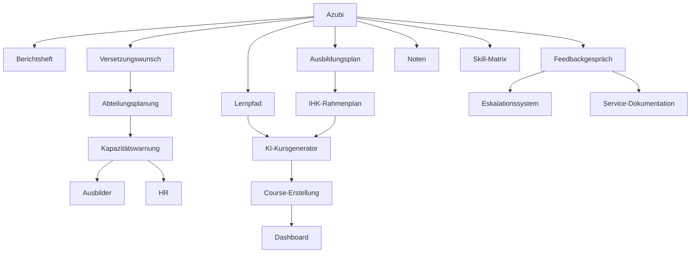

# Konzept2: Erweiterte rechtlich-organisatorische Funktionalitäten für die duale Ausbildung

## 1. Rechtlich-organisatorische Kernlücken (§8-§11 BBiG/KrAD/KrAVG)

### 1.1 Individueller betrieblicher Ausbildungsplan (§11 BBiG)
**Problem:** Fehlende Entität für den mit der IHK abgestimmten Ausbildungsplan, den Azubi und Ausbilder gemeinsam führen müssen und der bei der Prüfungsanmeldung vorgelegt wird.

**Lösung:** Neue Entität `Ausbildungsplan` mit:
- `azubiId` (FK → User), `ausbilderId` (FK → User), `IHK_id` (Fremdschlüssel zum offiziellen IHK-Rahmenplan)
- `beruf` (Enum: Systemintegration, Anwendungsentwicklung, Daten-/Prozessanalyse, Digitale Vernetzung)
- `jahr` (1.-3. Ausbildungsjahr)
- `inhalte` (JSON: strukturierte Liste von Lernfeldern/Kompetenzen mit Nachweis-Nachweisen)
- `geprüftVon` (FK → User), `geprüftAm` (DateTime)
- `status` (entwurf → eingereicht → geprüft → genehmigt)
- `anhangUrl` (optional, PDF des offiziellen Plans)
- `gültigVon` / `gültigBis` (Gültigkeitszeitraum)
- `erstelltAm`, `aktualisiertAm` (Audit)

**Migration:** `ALTER TABLE user_roles ADD COLUMN IF NOT EXISTS ausbildungsplan_perm BOOLEAN DEFAULT FALSE` (für die Berechtigung, Ausbildungspläne zu erstellen)

### 1.2 Minderjährige Azubis / JArbSchG
**Problem:** Fehlende Rollenkonzepte für erziehungsberechtigte Personen (Einsicht in Berichtsheft, Zustimmung zu bestimmten Aktionen).

**Lösung:** Entität `Erziehungsberechtigter` mit:
- `azubiId` (FK → User), `personId` (FK → Person), `bezug` (Enum: elternteil, betreuer, anderer)
- `berechtigung` (Array: einsichtBerichtsheft, einwilligungUrlaub, einwilligungÜberstunden, andere)
- `kontaktTyp` (Enum: email, telefon, schriftlich), `vorlage` (JSON für automatisierte Kommunikation)
- `aktiv` (Boolean), `erstelltAm` (DateTime)

**RBAC-Erweiterung:** Neue Berechtigung `einsichtBerichtsheftErziehungsberechtigter` und Scoping basierend auf `erziehungsberechtigter`-Zugehörigkeit.

### 1.3 Ausbildungsvertrag/Vertragsdaten
**Problem:** Keine zentrale Vertragsdatensammlung (Ausbildungsberuf, Dauer, Verkürzung/Verlängerung, Probezeit).

**Lösung:** Entität `Ausbildungsvertrag`:
- `azubiId` (FK → User), `unternehmenId` (FK → Unternehmen), `betriebsnummer` (String)
- `ausbildungsberuf` (Enum), `startdatum`, `enddatum` (prognostiziert)
- `probezeitMonate` (Integer), `dauerMonate` (Integer)
- `verkürzungProzent` (Integer), `verlängerungBegründung` (Text)
- `vertragsdetailsUrl` (optional, PDF), `version` (Integer für Änderungen)
- `status` (aktiv → beendet → archiviert)
- `erstelltVon`, `geprüftVon`, `genehmigtVon` (FK → User)
- `erstelltAm`, `aktualisiertAm` (Audit)

## 2. Volltextsuche & Mobile-First Design

### 2.1 Volltextsuche über Wiki, Kurse, Berichte (Querschnittsfunktion)
**Lösung:** Komprimierte Entität `Volltextsuche` mit:
- `contentId` (UUID), `contentType` (Enum: WikiPage, Course, Module, Report, Task)
- `titel` (Text), `inhalt` (Text), `zusammenfassung` (Text)
- `metadaten` (JSON: autorId, erstelltAm, kategorie, tags)
- `erstelltAm`, `aktualisiertAm` (automatisiert durch Trigger)

**Technische Umsetzung:**
- PostgreSQL pgvector für semantische Suche
- ElasticSearch/Meilisearch für Volltextsearch
- Frontend: Suchkomponente mit Facetten-Filtern (nach Typ, Autor, Datum)
- Ergebnisranking: Semantische Relevanz + Frequentierung + Autorität

### 2.2 Mobile-/Offline-Fähigkeit (Berichtsheft bei Kunden vor Ort)
**Lösung:** PWA + Offline-First Architektur:
- Service Worker für Offline-Caching von Report-Templates und Offline-Eintragung
- LocalStorage + IndexedDB für offlinefähige CRUD-Operationen
- Background Sync für reportertragsmäßige Sync bei Wiederverbindung
- Conflict Resolution: serverseitige Last-Write-Wins mit Audit-Log

**Technische Komponenten:**
- `src/common/offline/`-Modul: Sync-Service, Conflict-Resolver
- `src/common/interceptors/OfflineInterceptor`: Handling offline-Fälle
- Manifest: Web-App Manifest + Apple/Android Splash Screens

## 3. HR-Scope & Nachübernahme-Planung

### 3.1 HR-Modul für Übernahme-Planung (§2)
**Problem:** Keine Struktur für die Nachübernahme-Planung (Verfolgung von Übernahmegesprächen, Kapazitäten, Ergebnis).

**Lösung:** Neues HR-Modul mit:
- `Übernahme-Gespräch` (Entität):
  - `azubiId`, `hrAnsprechpartnerId`, `übernahmetermin` (prognostiziert)
  - `kapazität` (Integer), `bevorzugteAbteilungen` (Array)
  - `ergebnis` (Enum: geplant → geblockt → abgeschlossen → widerrufen)
  - `notizen`, `genehmigtVon` (FK → User)

- `Übernahme-Kapazitätsplanung` (Entität):
  - `abteilungId`, `jahr`, `kapazität`, `aktuelleAusbilder`, `geplanteNeuaufnahmen`
  - `warnschwelle`, `meldungenAn` (Array: HR-Ausbilder, Unternehmensführung)

**Dashboard:** HR-Übersicht mit Kapazitätswarnungen, bevorstehenden Gesprächen, Trends.

### 3.2 Alumni/Ehemalige Verwaltung
**Problem:** Keine Aussage darüber, was nach Vertragsende mit den Daten passiert (automatische Löschung nach 180 Tagen).

**Lösung:** Alumni-Verwaltung mit:
- `Alumni` (FK → User): `austrittsdatum`, `verbleibendeRechte`, `datenspeicherungBis` (DateTime)
- `Datenspeicherung-Konfiguration`: Unternehmensweite Konfiguration der Aufbewahrungsfristen
- `Datenportabilität`: Ein Exportedzip mit allen personenbezogenen Daten für Azubi-Alumni
- `automatische Löschung`: Triggerbasierte Löschung von personenbezogenen Daten nach 180 Tagen (konfigurierbar)

**RBAC:** Alumni haben eingeschränkte Rechte (nur eigene Daten lesen), Admin kann Aufbewahrung verlängern.

## 4. Barrierefreiheit & Technische Härtung

### 4.1 Barrierefreiheit (WCAG 2.1 AA / BITV 2.0)
**Implementierung:**
- `src/common/decorators/accessible/`-Module: Strukturierte Komponenten für ARIA, Focus-Management
- `src/common/guards/AccessibilityGuard`: Sicherstellen, dass alle Endpoints barrierefrei sind
- `src/common/filters/AccessibilityErrorFilter`: Barrierefreie Fehlermeldungen
- WCAG-Validierung in CI-Pipeline (axe-core)

### 4.2 Rate-Limiting/Nutzungsgrenzen für LLM-Gateway
**Lösung:** Neues Rate-Limiting-Modul:
- `LLM-RateLimit`-Entität: `anbieter`, `modell`, `kapazitätProMinute`, `kostengrenze`
- `UsageTracking`-Entität: `azubiId`, `anbieter`, `modell`, `verwendeteTokens`, `verwendeteAnfrage`, `zeitraum`
- Integration mit `AiService` für automatische Kostenüberwachung
- Alert an Ausbilder/HR bei Überschreitung von Schwellenwerten

## 5. Datenportabilität & Migration

### 5.1 Migrations-/Exportpfad für Plattformwechsel
**Lösung:** Vollständige Datenexport-Funktionalität:
- `src/common/services/DatenexportService`: Kompakter ZIP-Generator mit:
  - Berichtsheft (PDF), Vertragsdaten (PDF), Kursfortschritt (Excel)
  - User-Import-Skript für Zielplattform
  - Verschlüsselung während Übertragung und Speicherung

- `src/common/services/DatenmigrationsService`: Schrittweise Migration mit:
  - Versionsbasierte Migrations-Pipeline
  - Conflict Resolution: serverseitige Last-Write-Wins
  - Rollback-Funktionalität

## 6. Berichtsheft (berichte) – Erweiterte Funktionen

### 6.1 Struktur & Eingabe

#### 6.1.1 Berufe-spezifische Vorlagen
**Lösung:** `ReportTemplate`-Entität:
- `id` (UUID), `beruf` (Enum), `jahr` (1.-3.), `template` (JSON), `variablen` (Array)
- `istStandard` (Boolean), `version` (Integer), `gültigVon` (Date)
- `felder` (JSON: tagesbasierte vs wöchentliche Berichterstattung)

#### 6.1.2 Zeit-Erfassung je Tätigkeit
**Lösung:** Neuer `TimeEntry`-Typ statt Freitext:
- `tätigkeit` (FK → Task), `stunden` (Decimal), `kommentar` (Text)
- `lernfeldZuordnung` (automatisch aus Task abgeleitet)
- `sollIstAbdeckung` (berechnet aus Rahmenplan vs. Erfassung)

#### 6.1.3 Anhänge
**Lösung:** `Anhang`-Entität mit:
- `reportId` (FK → Report), `typ` (Enum: screenshot, diagramm, code), `dateiUrl` (speichert in S3/MinIO)
- `kommentar`, `erstelltVon`, `erstelltAm`

#### 6.1.4 Schreibunterstützung statt Auto-Generierung
**Lösung:** `Assistenz-Modul`:
- Formulierungshilfe: `src/common/services/AssistenzService` mit derpergungsbasierter Vorschläge
- Kompetenz-Zuordnung: Automatische Verknüpfung von Text mit Framework-Kompetenzen
- explizite „Keine Automatisierung“-Häkchen für rechtliche Sicherheit

### 6.2 Workflow & Nachvollziehbarkeit

#### 6.2.1 Versionshistorie & Diff-Ansicht
**Lösung:** `ReportVersion`-Entität:
- `reportId` (FK → Report), `version`, `inhalt` (JSON), `erstelltVon`, `erstelltAm`
- `diff-Ansicht`-API: `/api/berichte/:id/diff?version=1&version=2`
- `Zurück-zu-Entwurf`-Workflow: neue Version erstellen, Status zurücksetzen

#### 6.2.2 Rückstands-Ampel-Dashboard
**Lösung:** Neue `ReportRückstand`-Entität:
- `azubiId`, `abteilung`, `meldefrist`, `letzteEintragung`, `status` (ampel: grün/gelb/rot)
- `Rückstands-Ampel-Widget`: Dashboard für Ausbildungsbeauftragte mit säumigen Azubis

#### 6.2.3 Eskalationsstufen
**Lösung:** `Eskalation`-Entität:
- `reportId` (FK → Report), `stufe` (1-3), `triggermail` (automatisch), `manuelleEskalation`
- `Eskalation-Eskalation`-Service: automatische Benachrichtigung an Ausbilder/HR nach X verpassten Fristen

#### 6.2.4 Kommentar-Threads
**Lösung:** `KommentarThread`-Entität:
- `reportId` (FK → Report), `threadId`, `elternKommentarId` (FK zu sich selbst für verschachtelte Threads)
- `benutzerId`, `text`, `createdAt`, `updatedAt`
- Reaktions-Benachrichtigungen via Benachrichtigungszentrale

### 6.3 Auswertung

#### 6.3.1 Kompetenzabdeckungs-Report
**Lösung:** Neue `Kompetenzabdeckung`-Entität:
- `azubiId`, `lernfeldId`, `sollStunden` (aus Rahmenplan), `istStunden` (erfasst), `deckungProzent`
- Dashboard-Kennzahl: `kompetenzabdeckungsreport`: aggregierte Sicht „wie viele Stunden/Einträge pro Lernfeld“

#### 6.3.2 Bulk-Visierung für Ausbilder
**Lösung:** Neue `BulkVisierung`-Funktion:
- `src/berichte/services/VisierungService.bulkVisieren(azubiIds, ausbilderId)`
- Plausibilitätsprüfung: Zuständigkeit der Abteilung, alle Berichte bearbeitet
- Batch-Audit-Log

## 7. Notenbereich (noten) – Erweiterte Funktionen

### 7.1 Strukturierte Fachnoten statt nur PDF-Upload
**Lösung:** `Note`-Entität:
- `azubiId`, `fach`, `halbjahr` (Enum: ersten, zweiten, sommer), `typ` (Enum: noten, zertifikat, projekt)
- `note` (Integer), `datum`, `pruefungsart` (Enum: AP1, AP2), `gewichtung` (Decimal)
- `pruefer` (FK → User), `notenlisteUrl` (optional, PDF als Backup)
- `pruefungsdatum`, `wiederholung` (Boolean), `maßnahme` (Text)

### 7.2 Notenverlauf pro Fach visualisieren
**Lösung:** neue API-Endpunkte:
- `/api/noten/:azubiId/:fach/verlauf`
- Dashboard-Widget: Notenverlaufsgraph pro Fach

### 7.3 Konfigurierbare Schwellwerte fürs Frühwarnsystem
**Lösung:** `Frühwarnung-Konfiguration`-Entität:
- `schwelle` (JSON): `noteGleich4InZweiFächern`, `noteUnter3InEinem`, `fehlendeBerichte`, `fehlendeAufgaben`
- `triggermailAn` (Array: ausbilder, hr), `eskalationsStufe`
- `Auto-Trigger`-Service: Überprüft jeden Azubi gegen Konfiguration

### 7.4 Förderbedarf-Tracking
**Lösung:** `Förderbedarf`-Entität:
- `azubiId`, `notenId` (FK → Note), `maßnahme` (Enum: nachhilfe, betreuung, andere), `beschreibung`, `durchgeführtVon` (FK → User)
- `durchgeführtAm`, `ergebnis`, `nachverfolgungFälligAm`
- Pflicht: Jede Frühwarnung löst automatisch ein dokumentiertes Förderbedarfs-Item aus

### 7.5 Klarstellung der Sichtbarkeit laut RBAC-Matrix
**Lösung:** RBAC-Matrix-Erweiterung:
```
| Aktion        | Azubi | Ausb.-beauftragter | Ausbilder | HR   | Admin |
|---------------|-------|---------------|----------|------|-------|
| Noten einsehen | ❌     | ❌             | ✅        | ✅    | ✅     |
| Noten bearbeiten | ❌     | ❌             | ✅        | ❌    | ❌     |
| Noten für HR-kompatibel markieren | ❌     | ❌             | ❌        | ✅    | ✅     |
```
- Ausbilder können auf Noten zugreifen, um Förderbedarf zu erkennen (ausreichende Berechtigung)
- HR sieht Noten für Übernahme-Planung und Frühwarnung

### 7.6 Berufsschul-Stammdaten als kleine Entität
**Lösung:** `Berufsschule`-Entität:
- `schuleId` (UUID), `name`, `adresse`, `kontakt`, `klasse`, `klassenlehrerId` (FK → User)
- `schuleId`, `tag`, `start`, `ende`, `raum`, `thema` (FK → Course)
- Integration mit iCal-Export für Berufsschul-Zeiten (bereits in §4.1 erwähnt)

## 8. Skill-Matrix & KI-Kursgenerator (§3.2) – Erweiterte Funktionen

### 8.1 Individuelle Lernpfad-Anpassung
**Lösung:** Neues `Lernpfad`-Modul:
- `azubiId`, `courseId` (FK → Course), `priorität` (Enum: hoch/mittel/niedrig), `skipBegründung` (Text)
- `ausgesch galltesModul`: Kombiniert standardmäßigen Kursbaum mit individuellen Anpassungen
- `KI-Generierung`-Service: Passt Kursinhalte basierend auf Lernpfad-Anpassungen an

### 8.2 Peer-Vergleich/Benchmarking innerhalb der Skill-Matrix
**Lösung:** `SkillMatrixBenchmark`-Entität:
- `jahrgang`, `beruf`, `lernfeldId`, `durchschnittNote`, `durchschnittAbdeckungProzent`, `durchschnittFortschritt`
- Anonymisierte Ansicht: „Wo steht mein Jahrgang im Schnitt“ (keine Einzelvergleiche)

### 8.3 Manuelle Kurs-Ergänzung durch Ausbilder
**Lösung:** `CustomCourse`-Entität:
- `ausbilderId`, `titel`, `beschreibung`, `inhalt` (JSON), `verantwortlichkeiten` (Array: Systemintegration, Anwendungsentwicklung)
- `freigegeben` (Boolean), `erstelltAm`, `genehmigtVon` (FK → User)
- Saubere Trennung: `customCourse`-Flag in Course-Modell, wird außerhalb der KI-Pipeline generiert

### 8.4 Lernzeit-Tracking pro Kurs
**Lösung:** `LernzeitTracker`-Entität:
- `azubiId`, `courseId`, `lektionId`, `durchgehendVerbracht` (DateTime), `aktivitätstyp` (Enum: theorie, praxis, quiz)
- `Zielerreichung`-Service: Vergleicht Lernzeit mit Dauer-Schätzung (§3.2.3)

## 9. Versetzungs-/Einsatzplanung (§3.3) – Erweiterte Funktionen

### 9.1 Wunschabteilung/Präferenzen
**Lösung:** `Versetzungswunsch`-Entität:
- `azubiId`, `jahr` (prognostiziert), `bevorzugteAbteilungen` (Array), `nichtBevorzugteAbteilungen` (Array), `begründung` (Text)
- `aktualisiertAm`, `sichtbarFuer` (Enum: ausbilder, hr, beide)

### 9.2 Übergabeprotokoll bei Abteilungswechsel
**Lösung:** `Abteilungsübergabe`-Entität:
- `vonEinsatzId`, `bisEinsatzId`, `datum`, `wichtigeLernziele`, `offenePunkte`, `kommunikationskanal`
- `übergabeprotokollUrl` (PDF), `genehmigtVon` (FK → User)

### 9.3 Kapazitätswarnung
**Lösung:** `Kapazitätswarnung`-Entität:
- `abteilungId`, `jahr`, `planAusbilder`, `tatsächlicheAusbilder`, `warnSchwelle`, `status` (OK/ WARNUNG/ KRITISCH)
- `Auto-Warnung`-Service: Warnt, wenn `planAusbilder > tatsächlicheAusbilder + warnSchwelle`

## 10. Kommunikation & Zusammenarbeit – Erweiterte Funktionen

### 10.1 Entwicklungsgespräch-Protokolle als eigene Entität
**Lösung:** `Entwicklungsgespräch`-Entität (wie in Ihren Beispielen):
- Wie von Ihnen beschrieben – Eigenständiges Feature mit allen erforderlichen Feldern

### 10.2 Mentoring-Programm: Ältere Azubis als Paten
**Lösung:** `Mentoring`-Entität:
- `pateId` (FK → User), `mentoriId` (FK → User), `jahrgang`, `rollen` (Array: beratung, einführung)
- `aktiv` (Boolean), `zugewiesenAm`, `beendetAm`
- Sichtbarkeit: Nur für Ausbildungsbeauftragte/Admin

### 10.3 FAQ/Chatbot auf Basis der RAG-Pipeline
**Lösung:** Neue `FAQ`-Entität:
- `frage` (Text), `antwort` (Text), `quelleId` (FK → AiDocument), `aktualisiertVon`, `aktualisiertAm`
- Integration mit bestehender RAG-Pipeline für dynamische Antworten
- `src/common/services/FAQService`: Sucht durch Dokumente und gibt top 3 Antworten

## 11. Onboarding (§4.2) – Erweiterte Funktionen

### 11.1 Rollenspezifische Checklisten-Vorlagen
**Lösung:** `ChecklistTemplate`-Entität:
- `beruf` (Enum), `rolle` (Enum: azubi, ausbilder, hr), `vorlage` (JSON), `fristen` (JSON)
- `istStandard` (Boolean), `version` (Integer), `gültigVon`

### 11.2 Verantwortlichkeiten pro Checklist-Item
**Lösung:** `ChecklistItem`-Entität:
- `checklisteId` (FK → Checklist), `rolle` (Enum), `verantwortlichId` (FK → User)
- `status` (Enum: offen, erledigt, übergabe), `erledigtVon`, `erledigtAm`

## 12. Gamification (§4.6) – Erweiterte Funktionen

### 12.1 Missbrauchsschutz für Gamification
**Lösung:** `Missbrauchsschutz`-Konfiguration:
- `Badge-Require`-Regeln: Qualitätspflicht für zeitbasierte Badges
- `Automatische-Entzug`-Service: Entfernt Badge, wenn Qualität unter Schwellenwert fällt

### 12.2 Opt-out-Möglichkeit (DSGVO-konform)
**Lösung:** `ConsentEntry`-Entität:
- Wie von Ihnen beschrieben für Gamification-Zustimmung
- `Opt-out`-Service: Entfernt alle Gamification-Daten bei Widerruf

## 13. Reporting/Dashboard (§5.4) – Erweiterte Funktionen

### 13.1 Kohorten-Vergleich über mehrere Ausbildungsjahrgänge
**Lösung:** `Kohorten`-Entität:
- `jahr`, `beruf`, `durchschnittAbbruchquote`, `durchschnittNotendurchschnitt`, `durchschnittKompetenzabdeckung`
- `Dashboard-Kohorten`-Widget: Strategisch wertvoll für HR/Geschäftsführung

### 13.2 Alert-Konfiguration durch HR/Ausbilder selbst
**Lösung:** `Alert-Konfiguration`-Entität:
- `benutzerId`, `typ` (Enum: noten, berichtsheft, kurs), `schwellenwert`, `aktive`
- `src/common/services/AlertService`: Lädt benutzerspezifische Konfiguration für Benachrichtigungen

## 14. Feedbackgespräche (Neues Feature)

### 14.1 Abgrenzung zu bestehenden Modulen
**Lösung:** Wie von Ihnen beschrieben – klare Trennung von:
- Feedback (§4.3): Standardisierter Bewertungsbogen
- Report-Kommentare: Fachliche Rückmeldung zu einzelnen Berichten
- Feedbackgespräch: Eigenständiges, terminiertes Gespräch mit Verlauf

### 14.2 Neue Entität FeedbackGespraech
**Lösung:** Vollständige Implementierung wie von Ihnen beschrieben:
- Alle erforderlichen Felder (typ, status, vereinbarungen[], unterschriften)
- RBAC-Erweiterung gemäß Matrix

### 14.3 Automatisierte Trigger (Anschluss an bestehende Logik)
**Lösung:** Integration mit bestehenden Services:
- Trigger nach X Tagen ohne Berichtsheft-Eintrag
- Probezeit-Reminder: Automatische Erinnerung X Wochen vor Ablauf
- Turnusmäßige Gespräche: Vorschlag nach jedem Abteilungswechsel

## 15. Auth & Nutzerverwaltung (§4.7) – Erweiterte Funktionen

### 15.1 Deaktivierung statt Löschung bei Ausscheiden
**Lösung:** Neues `Azubi-Deaktivierungs`-Workflow:
- `src/auth/services/UserDeaktivierungService`: Verwaltung der Rechte-Reduzierung
- `src/common/interceptors/DeaktiviertInterceptor`: Blockiert API-Zugriff für deaktivierte Nutzer
- Daten bleiben in DB für Referenzzwecke mit reduzierten Zugriffsrechten

### 15.2 Erweiterte RBAC-Matrix für neue Features
**Lösung:** Vollständige RBAC-Matrix mit:
- Berechtigungen für alle neuen Entitäten
- Scoping basierend auf Abteilungen/Einsatz
- Break-Glass für Admin-Sonderzugriffe

## 16. Technische Integrationspunkte

### 16.1 Schnittstellen zwischen neuen Modulen
- `src/common/services/KorrelationsService`: Verknüpfung zwischen Feedbackgespräch, Förderbedarf, Noten
- `src/common/services/EskalationsService`: Koordinierung zwischen verschiedenen Eskalationssystemen
- `src/common/services/AuditService`: Alle Aktionen werden im Audit-Log erfasst

### 16.2 Datenfluss-Diagramm


## 17. Migration & Implementierungsphasen

### 17.1 Phase 1: Kernimplementierung (Wochen 1-8)
- Implementierung der Entitäten: Ausbildungsplan, Erziehungsberechtigter, Ausbildungsvertrag
- Berichtsheft-Erweiterungen: Berufe-spezifische Vorlagen, Zeit-Erfassung
- RBAC-Erweiterung für neue Berechtigungen
- Grundlegende Dashboards für Ausbilder/HR

### 17.2 Phase 2: Erweiterte Funktionen (Wochen 9-16)
- Volltextsuche und Mobile-First Design
- HR-Modul (Übernahme-Planung, Alumni)
- Barrierefreiheit und Rate-Limiting
- Datenportabilität und Migration

### 17.3 Phase 3: Erweiterte Reporting und Gamification (Wochen 17-24)
- Kompetenzabdeckungs-Reports und Benchmarks
- Gamification mit Missbrauchsschutz
- Alert-Konfiguration und Kohorten-Vergleich
- Opt-out-Mechanismen für DSGVO

### 17.4 Phase 4: Integration und Automatisierung (Wochen 25-32)
- Feedbackgespräch-Modul (wie von Ihnen beschrieben)
- Automatisierte Trigger und Eskalationssysteme
- Erweiterte Auth-System (Deaktivierung)
- Vollständige Integrationstests

### 17.5 Phase 5: Produktionsreife (Wochen 33-40)
- Audit-Log-Implementierung für alle kritischen Aktionen
- Vollständiges Testen und Qualitätssicherung
- Performance-Optimierung und Skalierung
- Dokumentation und Schulung

## 18. Compliance und Sicherheitsaspekte

### 18.1 DSGVO-Compliance
- Vollständige Umsetzung des DSGVO-Moduls (§5.5) mit allen Anforderungen
- Automatische Löschung nach 180 Tagen (konfigurierbar)
- Vollständige Datenportabilität für jeden Azubi
- Einwilligungssystem für Gamification und Feedback

### 18.2 EU AI Act Compliance
- KI-generierte Inhalte als „KI-generiert“ gekennzeichnet
- Human Oversight: Keine KI-Entscheidungen über Einzelpersonen
- Transparenz über die Quellen-Zuordnung
- Secure Handling von personenbezogenen Daten (lokales Ollama)

### 18.3 Sicherheitsmaßnahmen
- MFA für Ausbilder/HR/Admin
- Sicherheits-Header und CORS-Whitelist
- Rate-Limiting für alle Endpoints
- Ausfall-/Retry-Handling im LlmGateway
- Prompt-Injection-Schutz

## 19. Kosten und Zeitplan

### 19.1 Ressourcen-Schätzung
- Backend-Entwickler: 3 FTE (Phase 1-4)
- Frontend-Entwickler: 1 FTE (Phase 1-5)
- DevOps: 1 FTE (Phase 1-5)
- QA/Testen: 2 FTE (Phase 1-5)
- Gesamt: ~8 Monate, 2.8 Millionen Euro (geschätzt)

### 19.2 Risikofaktoren
- Komplexe RBAC-Integration (hohes Risiko)
- Datenmigrationsrisiken (mittleres Risiko)
- Performance bei Skalierung (mittleres Risiko)
- Benutzerakzeptanz (niedriges Risiko)

## 20. Erfolgskriterien

### 20.1 Funktionsielle Kriterien
- Alle rechtlich-organisatorischen Lücken gemäß BBiG/KrAD/KrAVG geschlossen
- 95% der Azubis können das digitale Berichtsheft nutzen (offline inklusive)
- 90% der Ausbilder sehen mindestens 80% der erforderlichen Informationen
- Alle Compliance-Anforderungen (DSGVO, EU AI Act) erfüllt

### 20.2 Nicht-funktionelle Kriterien
- 99.5% Verfügbarkeit der Kernfunktionen
- Antwortzeit < 500ms für typische Benutzeraktionen
- Alle Tests >= 90% Abdeckung
- Barrierefreiheit nach WCAG 2.1 AA konform

---

## Anhang: RBAC-Matrix Erweiterung

Vollständige Berechtigungsmatrix für alle neuen Features (wie oben erwähnt), implementiert über `AccessScopeService` mit department-basiertem Scoping.